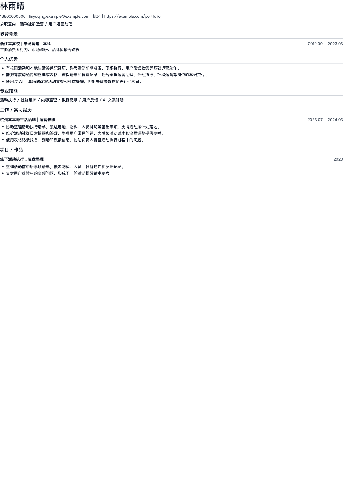
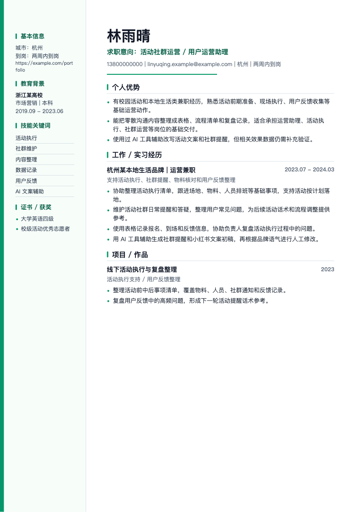
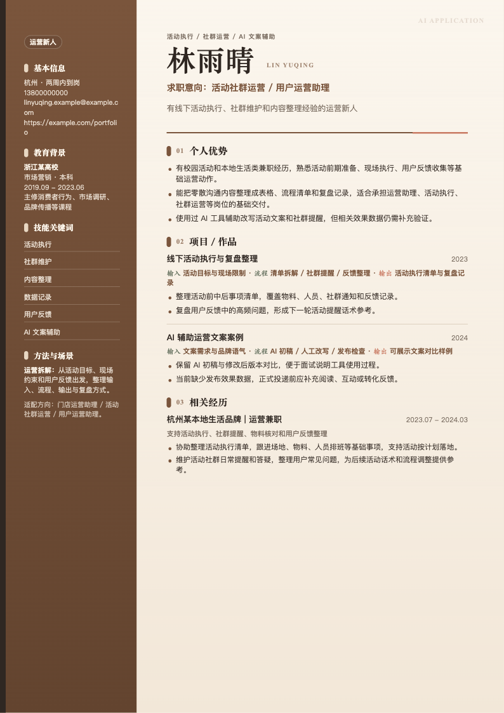

# job-search-companion

面向中国大陆求职场景的求职陪跑 Skill。它不是只帮你“润色简历”，而是把求职拆成一套可复用流程：资料收集、经历挖掘、证据建模、JD 拆解、简历编排确认、投递沟通、面试准备、谈薪与 Offer 复盘。

适用对象不限软件开发，也不限互联网岗位。应届生、转行候选人、门店/销售/行政/内容/运营/设计/教育/服务业等经历，都可以先整理成素材，再按目标岗位取舍。

## 能做什么

- 用 3 个以内的问题启动，不让用户一上来填大表。
- 从旧简历、文件夹、截图、作品链接、聊天描述中整理候选人素材。
- 把经历拆成“事实、证据、风险、待确认数字”，避免编造。
- 针对 JD 做岗位画像、关键词、硬门槛、红旗词和匹配判断。
- 生成简历编排建议，先和用户确认重点，再写简历。
- 多段经历给出“放入正文 / 弱化 / 移入作品集 / 暂不使用”的取舍。
- 支持 BOSS/微信/内推等国内短沟通话术。
- 覆盖敏感问题、空窗期、频繁跳槽、薪资流水、五险一金、背调、三方协议等国内常见环节。
- 内置 Markdown/HTML 简历转 PDF 的模板、主题色和 QA 规则。

## 简历 PDF 示例

示例使用虚构候选人数据，仅用于展示模板效果。

### ATS 单栏版

适合平台解析、官网网申、批量投递和附件归档。



### 中文侧栏版

适合人工阅读、微信转发、BOSS/猎聘附件，以及希望有一点视觉层次但仍保持稳重的场景。



### zc 视觉侧栏版

仅在用户明确要求 `zc风格简历`、`zc配色` 或选择 `--theme zc` 时启用。它更偏个人作品集感，不作为默认投递模板。



## 安装方式

把本仓库放到 Codex Skills 目录下：

```bash
mkdir -p ~/.codex/skills
git clone https://github.com/leoli001031-blip/job-search-companion-skill.git ~/.codex/skills/job-search-companion
```

如果你使用的 Agent 支持指定 skills 目录，可以显式传入：

```bash
--skills-dir "$HOME/.codex/skills"
```

## 基本使用

你可以用任何方式开始：

```text
我想找工作，但简历很乱，不知道怎么开始。
```

或者直接给材料：

```text
这是我的旧简历和一个想投的 JD，帮我先判断怎么改。
```

也可以只做一个局部任务：

```text
帮我把这段经历写成简历 bullet，但不要夸大。
```

Skill 会根据当前任务选择最小路径。轻量任务不会强行跑完整流程；完整简历、PDF、JD 定制、作品集等重要产物会附评分、风险、缺口和下一步补强建议。

## 核心流程

```text
接收资料 -> 素材整理 -> 证据建模 -> 目标澄清 -> JD 拆解
-> 差距分析 -> 简历编排确认 -> 材料生成 -> 输出评分
-> 投递沟通 -> 面试准备 -> 谈薪 / Offer 复盘
```

生成完整简历或 PDF 前，必须先确认：

- 这版简历优先突出什么。
- 哪些经历放进正文，哪些弱化或移入作品集。
- 是否需要 ATS 版、视觉版、照片版或 zc 风格版。
- 哪些事实、数字、截图和公开边界仍未确认。

## PDF 导出

内置导出器位于：

```text
scripts/render-resume-pdf.mjs
```

示例：

```bash
node scripts/render-resume-pdf.mjs \
  --input examples/resume-pdf-data.example.json \
  --out /tmp/resume-out \
  --template cn-sidebar \
  --theme green
```

支持的常用模板：

- `ats-clean`
- `cn-single-polished`
- `cn-sidebar`
- `cn-formal`
- `right-rail-modern`
- `top-band-compact`
- `zc-sidebar-visual`

支持的主题：

- `blue`
- `green`
- `black`
- `orange`
- `navy`
- `teal`
- `cyan`
- `indigo`
- `wine`
- `slate`
- `zc`

导出器会检查：

- 是否残留模板占位符。
- 是否误把评分、风险提示、通篇复核等内部内容放入正式简历。
- 是否残留 `[待确认]`、`[待补充]`。
- 模板容量是否导致多段经历/项目被静默省略。
- PDF/PNG 是否真实生成，而不是只生成 HTML。

## 目录结构

```text
.
├── SKILL.md
├── agents/
├── assets/
│   └── resume-pdf-templates/
├── docs/
│   ├── demo/
│   └── images/
├── examples/
├── references/
└── scripts/
```

## 设计原则

- 不编造公司、岗位、证书、项目、指标或成果。
- 不把“参与/协助/学习中”写成“主导/负责/熟练”。
- 简历不是证据仓库；截图、内部表格、聊天记录优先做脱敏作品集或案例页。
- 国内求职默认考虑平台简历、附件简历、BOSS/微信短沟通、谈薪和背调。
- 分数评价的是材料成熟度和岗位匹配度，不评价候选人本人。

## 隐私边界

不要把以下内容直接放入简历、README 示例或公开作品集中：

- 身份证、银行卡、完整住址、薪资流水。
- 未脱敏的内部表格、客户名单、门店销售额、同事姓名。
- 微信群原始聊天截图、头像、昵称、投诉原文。
- 用户标注“只供参考 / 不要公开 / 不要写”的材料。

## License

暂未指定开源许可证。未经作者明确授权，不建议直接用于商业分发。
