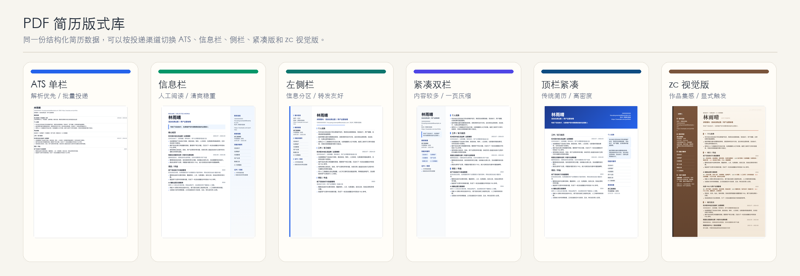
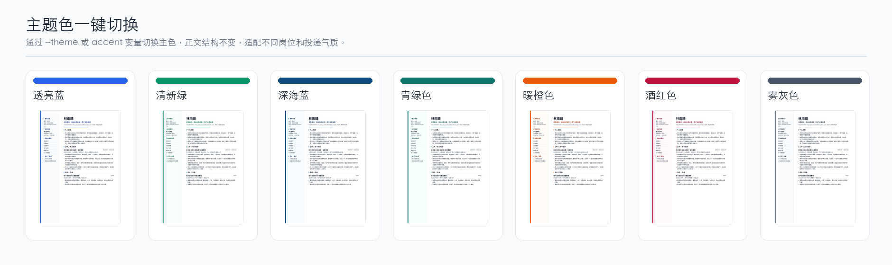

# job-search-companion

把旧简历、岗位截图、项目记录和口述经历，整理成可以投递、可以面试、经得起追问的中文求职材料。

很多人不是没有经历，而是不知道怎么把经历说清楚：哪段该放进简历，哪段更适合做作品集；哪些数字可以写，哪些还需要确认；投不同岗位时，教育、实习、项目和工作经历应该怎么排序。

这个技能就是用来处理这些判断的。你可以先把手头材料丢进来，哪怕只有旧简历、岗位截图、作品链接，或者一段没整理好的口述经历。它会边读边问，把材料整理成简历、PDF、投递话术、面试故事和谈薪准备。

它默认面向中国大陆求职环境：BOSS/智联/猎聘、微信沟通、内推、校招/社招、照片取舍、空窗期、转行、第一学历、薪资流水、五险一金等细节都会纳入考虑。适用对象不限程序员，也不限互联网岗位。

## 适合这些情况

- 有旧简历，但越改越乱，不知道该删什么、补什么。
- 手上有项目、作品、实习、兼职、校园经历，却不知道哪段最能打。
- 想投不同岗位，但每次都在“全都写上”和“删到没东西”之间摇摆。
- 担心 AI 把经历写虚，数字、成果和职责经不起面试追问。
- 想做一份好看的 PDF 简历，又怕平台解析不出来。
- 不知道 BOSS、微信、内推、面试、谈薪每一步该怎么说。

核心原则很简单：**真实、克制、能落地。可以把经历讲清楚，不能把没做过的事写成做过。**

## 先看一个完整例子

假设一个虚构候选人毕业 1 年，做过连锁茶饮门店运营助理，想投“运营数字化专员”，但手上只有一份旧简历、几张飞书表格截图和一段很散的描述。

她可以这样开口：

```text
我做过门店巡检、培训卡片和飞书多维表，想投运营数字化岗位，但不知道怎么写进简历。
```

技能不会一上来直接写终稿，而是先把问题拆开：

1. 先问清楚：目标城市、到岗时间、想投岗位、哪些截图可以脱敏公开。
2. 把经历拆成几张卡片：门店巡检、培训材料、飞书表格、活动执行、AI 文案辅助。
3. 标出哪些内容证据更强，哪些只能保守写，哪些需要补数字。
4. 拆目标岗位：它到底要流程梳理、工具使用、门店协同，还是偏内容运营。
5. 给出简历编排建议：比如“教育前置 + 工作经历主线 + 作品集补充截图”。
6. 用户确认重点后，再生成投递版简历、PDF 版式、BOSS 开场白和面试追问准备。
7. 最后给一张评分表：这版哪里能投，哪里还弱，本周最该补什么。

最后出来的不是一份孤零零的简历，而是一组可执行材料：

- 一份适合平台解析的单栏简历。
- 一份适合人工阅读的 PDF 简历。
- 一个 3 页左右的脱敏作品集结构。
- 3 条 BOSS/微信开场话术。
- 2-3 个能被面试追问的经历故事。
- 一张“还缺哪些数字和证据”的补采清单。

## 简历 PDF 可以选版式

同一份结构化简历数据，可以按渠道切换不同版式。系统解析版负责平台识别，视觉版负责人工阅读，作品/案例页负责补充证据。



主题色可以通过主题参数或主色变量切换。正文结构不变，颜色只服务于岗位气质和阅读层级。



> 截图使用虚构候选人数据，仅用于展示模板效果。

## 它能帮你做什么

| 模块 | 解决的问题 | 典型产物 |
| --- | --- | --- |
| 快速启动 | 材料很乱、不知道怎么开始 | 3 个以内启动问题、已有材料清单、待补材料 |
| 经历整理 | 把经历、证书、作品、校园、兼职、项目先收拢 | 素材索引、经历卡片、可迁移能力标签 |
| 真实性检查 | 判断什么能写、什么要降级、什么不能公开 | 强/中/弱证据、公开边界、量化补采表 |
| 岗位描述拆解 | 从岗位描述里拆出硬门槛、任务、隐含要求和红旗词 | 岗位匹配矩阵、缺口清单、投递建议 |
| 简历编排 | 多段经历该怎么取舍，教育/项目/工作谁前置 | 2-3 套编排方案、经历取舍清单、重点确认清单 |
| 求职材料 | 输出简历、作品集、投递话术和面试材料 | 系统解析版简历、视觉 PDF、作品集结构、面试故事 |
| 国内投递 | 适配 BOSS、微信、内推、智联、猎聘等渠道 | 30-100 字开场、跟进话术、内推包 |
| 面试准备 | 处理 HR 面、业务面、主管面、群面、转行追问 | 自我介绍、项目深挖、公司理解、反问问题 |
| 谈薪与录用条件 | 拆税前、N 薪、五险一金、试用期、背调 | 薪资结构表、录用条件对比、风险清单 |
| 求职复盘 | 投递没反馈、连续失败、空窗焦虑时调整节奏 | 投递记录表、面试复盘、情绪与行动节奏 |

## 不一定每次都跑完整流程

如果只是一个小任务，比如“帮我改一句 BOSS 打招呼”，它会直接给短产物，不会强行展开所有步骤。

如果你要做完整简历或 PDF，它会先停下来和你确认：

- 这版简历优先突出什么。
- 哪些经历进入正文，哪些弱化或移入作品集。
- 是否需要系统解析版、视觉版、照片版、zc 风格版。
- 哪些数字、截图、公司名、学校名和公开边界仍未确认。

## 可以这样开口

迷茫启动：

```text
我想找工作，但简历很乱，不知道怎么开始。
```

带材料启动：

```text
这是我的旧简历、作品集链接和一个岗位描述。先帮我判断这版该怎么改。
```

只做局部任务：

```text
帮我把这段门店运营经历写成简历要点，但不要夸大。
```

针对岗位描述定制：

```text
我想投这个岗位，帮我拆岗位描述、判断匹配度，再告诉我简历应该突出哪些经历。
```

PDF 输出：

```text
把这版简历做成系统解析版和一个清新绿视觉版 PDF，先给我版式方案。
```

## 安装与使用

这是一个平台无关的 Agent Skill / instruction pack。核心结构只有一个要求：整个文件夹里必须有 `SKILL.md`，旁边保留 `references/`、`assets/`、`scripts/`。

### Claude Code

个人全局安装：

```bash
mkdir -p ~/.claude/skills
git clone https://github.com/leoli001031-blip/job-search-companion-skill.git ~/.claude/skills/job-search-companion
```

项目内安装：

```bash
mkdir -p .claude/skills
git clone https://github.com/leoli001031-blip/job-search-companion-skill.git .claude/skills/job-search-companion
```

在 Claude Code 中可以直接说：

```text
用 /job-search-companion 帮我整理求职材料。
```

如果 `/job-search-companion` 没出现在菜单里，先确认目录结构是：

```text
~/.claude/skills/job-search-companion/SKILL.md
```

不要只把仓库内容散放在 `~/.claude/skills/` 根目录。

### Codex

```bash
mkdir -p ~/.codex/skills
git clone https://github.com/leoli001031-blip/job-search-companion-skill.git ~/.codex/skills/job-search-companion
```

如果你的 Codex / Agent 运行器支持显式指定技能目录：

```bash
--skills-dir "$HOME/.codex/skills"
```

### Kimi CLI / Gemini CLI / 其他 Agent

如果对方没有原生 Skills 目录，也可以把仓库放在任意位置，然后在提示词中明确要求：

```text
请使用这个求职陪跑 instruction pack：
/path/to/job-search-companion

先读取 SKILL.md。
然后根据任务读取 SKILL.md 里的 Reference 路由中相关的 references/*.md。
如果需要导出 PDF，再查看 scripts/render-resume-pdf.mjs 和 assets/resume-pdf-templates/。
```

### Claude.ai / API

可以把 `job-search-companion` 文件夹打包成 zip 后上传为自定义 Skill。注意：不同 Claude 使用面之间的 Skills 不会自动同步；Claude Code、Claude.ai 和 API 需要分别安装或上传。

如果运行环境没有本地文件权限、浏览器、网络或 PDF 渲染能力，Skill 仍可用于简历/JD/面试/话术等文本产物；PDF 导出器和本地文件读取会降级为可复制内容或操作步骤。

### 触发方式

触发方式可以很自然：

```text
用 job-search-companion 帮我整理求职材料。
```

或：

```text
使用求职陪跑 skill，先帮我拆这个 JD，再告诉我简历要怎么贴。
```

如果某个 Agent 仍提示平台不匹配，通常是因为它只看到了旧版 README，或者把仓库安装到了另一个平台的目录。这个仓库本身遵循通用 `SKILL.md` 结构；在 Claude Code 里请安装到 `.claude/skills/job-search-companion/`。

## PDF 导出器

内置轻量导出器：

```text
scripts/render-resume-pdf.mjs
```

示例：

```bash
node scripts/render-resume-pdf.mjs \
  --input examples/resume-pdf-data.example.json \
  --out /tmp/resume-out \
  --template cn-sidebar \
  --theme green
```

常用模板：

| 模板 | 场景 |
| --- | --- |
| `ats-clean` | 平台解析、官网网申、批量投递 |
| `cn-single-polished` | 单栏精致版，适合大多数人工阅读 |
| `cn-sidebar` | 左侧栏版，适合信息分区和微信转发 |
| `right-rail-modern` | 右侧信息栏，清爽稳重 |
| `compact-two-column` | 内容较多，需要一页压缩 |
| `top-band-compact` | 顶部信息带，传统正式 |
| `zc-sidebar-visual` | zc 视觉风格，必须显式触发 |

常用主题：

```text
blue / green / black / orange / navy / teal / cyan / indigo / wine / slate / zc
```

导出器会做基础检查：

- 模板占位符是否残留。
- `[待确认]`、`[待补充]` 是否误进正式版。
- 评分、风险提示、通篇复核等内部内容是否污染简历。
- 多段经历/项目是否超出模板容量，被静默省略。
- PDF/PNG 是否真实生成，而不是只生成 HTML。

## 国内求职特化

这套技能默认按国内求职语境工作，覆盖：

- BOSS 直聘、智联、猎聘、前程无忧、拉勾、实习僧、官网网申。
- 微信发简历、加 HR、面试后跟进、微信群/熟人内推。
- 在线简历和附件简历的双轨检查。
- 国企/传统企业/校招/实习场景下的教育、证书、照片、政治面貌、籍贯/户籍判断。
- 年龄、婚育、空窗期、第一学历、非相关专业、户籍、频繁跳槽等敏感问题。
- 税前税后、N 薪、绩效、提成、五险一金、试用期、薪资流水、竞业、服务期、背调。
- 秋招/春招、群面、测评、笔试、三方协议、违约风险。

## 证据与隐私边界

它会区分两件事：

```text
证据强不强
能不能公开
```

例如内部表格、微信群截图、薪资流水、客户名单可能能证明经历，但不适合直接进入简历或公开作品集。

默认处理方式：

- 简历正文只写可读摘要。
- 截图、表格、文档、聊天记录优先做脱敏作品集或案例页。
- 用户标注“只供参考 / 不要公开 / 不要写”的材料，不能进入投递版。
- 没有确认的数字不写成真实成果。
- “协助/参与/使用过”不能升级成“主导/负责/熟练”。

## 目录结构

```text
.
├── SKILL.md
├── agents/
├── assets/
│   └── resume-pdf-templates/
├── docs/
│   ├── demo/
│   └── images/
├── examples/
├── references/
└── scripts/
```

重要参考文件：

- `references/evidence-model.md`
- `references/materials.md`
- `references/jd-tailoring.md`
- `references/output-evaluation.md`
- `references/pdf-export.md`
- `references/domestic-delivery-channels.md`
- `references/domestic-sensitive-questions.md`
- `references/domestic-salary-negotiation.md`
- `references/tracking.md`

## 限制

- 不能替用户编造经历、学历、证书、项目、数据或录用条件。
- 不能替代法律、税务、心理咨询或劳动仲裁专业意见。
- 公司调研必须区分事实、推断、匿名信息和信息不足。
- 视觉 PDF 不能替代系统解析友好的单栏版；正式投递前仍应打开预览做人工检查。

## 许可证

暂未指定开源许可证。未经作者明确授权，不建议直接用于商业分发。
